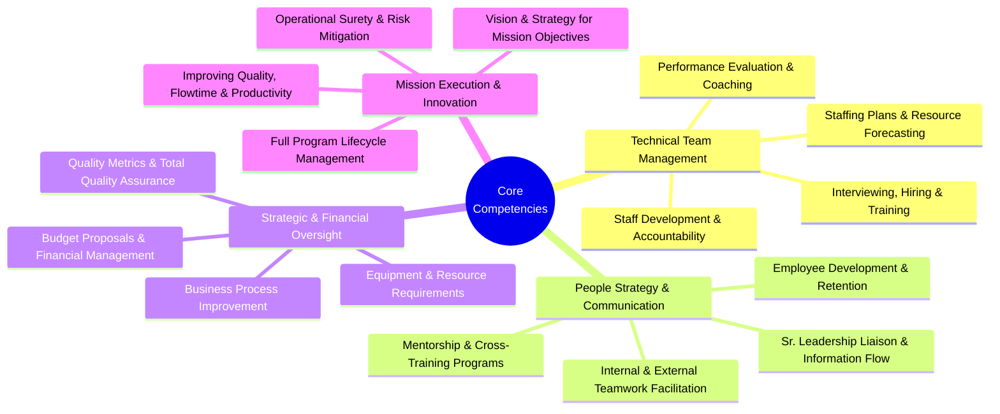
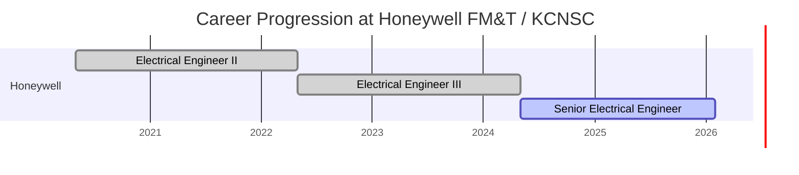
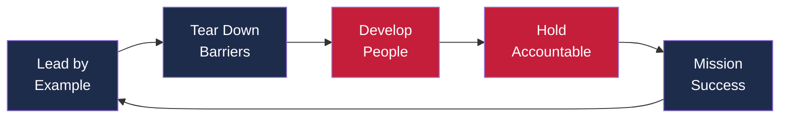
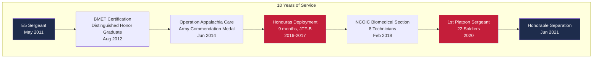
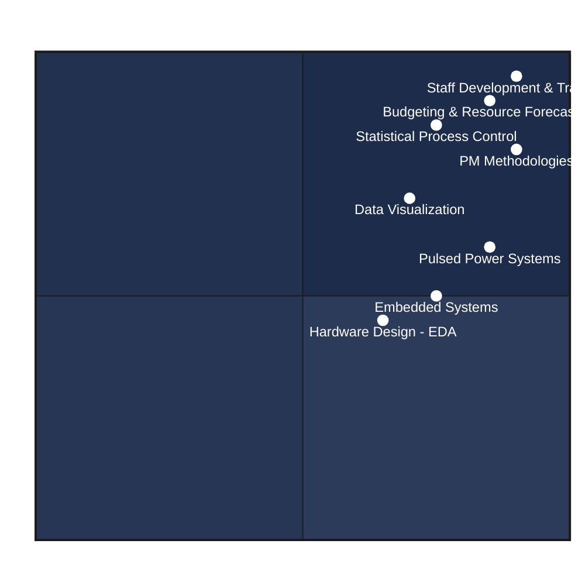
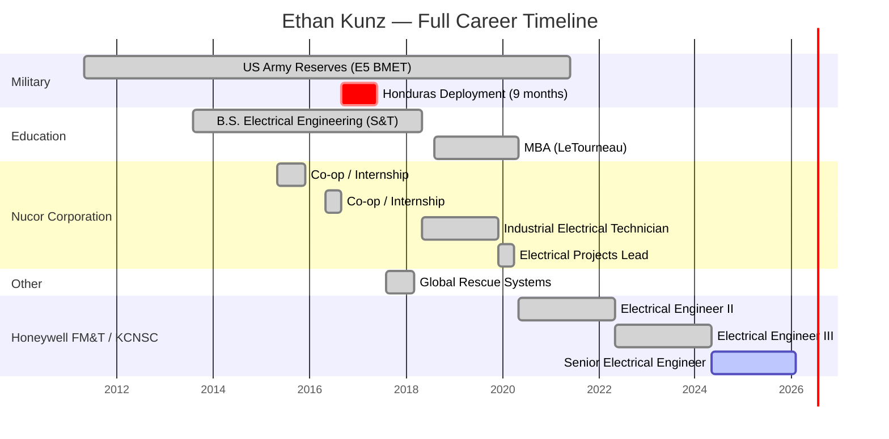

# ETHAN KUNZ

## Technical Manager | Engineering Leadership

**Pleasant Hill, MO 64080** | cell: on request | ethan.douglas.kunz@gmail.com | [linkedin.com/in/ethan-douglas-kunz](https://linkedin.com/in/ethan-douglas-kunz)

---

## Professional Summary

Hands-on technical leader with an MBA (4.0 GPA), a B.S. in Electrical Engineering (Cum Laude, ABET), an Active DOE Security Clearance, and a decade of high-stakes engineering experience — from the extreme industrial environments of steel manufacturing to directing multi-million dollar national security programs at Honeywell FM&T / KCNSC. I lead from the front as a servant leader: I practice what I preach, tear down barriers for my team, hold people accountable, and give them the tools I didn't have. I've managed budgets, staffing plans, and resource forecasts across programs worth many millions of dollars, cross-trained 7 teammates for critical roles, and mentored junior engineers through high-pressure QRC deliveries. U.S. Citizen with 7+ years of continuous engineering experience who thrives on building team capability, improving quality and flowtime, and driving mission objectives to completion.

---

## Core Competencies

| Technical Team Management | People Strategy & Communication |
|---|---|
| Staff Development & Accountability | Employee Development & Retention |
| Staffing Plans & Resource Forecasting | Mentorship & Cross-Training Programs |
| Interviewing, Hiring & Training | Internal & External Teamwork Facilitation |
| Performance Evaluation & Coaching | Sr. Leadership Liaison & Information Flow |

| Strategic & Financial Oversight | Mission Execution & Innovation |
|---|---|
| Budget Proposals & Financial Management | Vision & Strategy for Mission Objectives |
| Equipment & Resource Requirements | Full Program Lifecycle Management |
| Business Process Improvement | Improving Quality, Flowtime & Productivity |
| Quality Metrics & Total Quality Assurance | Operational Surety & Risk Mitigation |

---

## Professional Experience

### Honeywell FM&T / KCNSC — Kansas City, MO

**Senior Electrical Engineer** | May 2024 – Present
**Electrical Engineer III** | May 2022 – May 2024
**Electrical Engineer II** | May 2020 – May 2022

Serves as the primary technical and project leader for Special Projects, organizing, coordinating, and managing the execution of multi-million dollar pulse power initiatives supporting critical national security mission objectives.

#### Team Leadership & Staff Development

- Technical lead for a **significant six-figure** bi-annual training program, coordinating **50+ internal personnel** and managing engagement with up to **50 executive-level sponsors** per year — directly responsible for planning, assigning, and directing work.
- Cross-trained **7 teammates** for critical program roles by developing curriculum, justifying budget allocations to sponsors, and holding individuals accountable to committed objectives.
- Mentored multiple junior engineers by integrating them directly into high-stakes projects — giving them real responsibility, not busy work — including unit testing for a major QRC delivery.
- Consistently engages across science and engineering disciplines, cross-pollinating ideas that seed new R&D concepts and bring new work to the team.

#### Budget, Resource & Programmatic Management

- Orchestrated **many millions** of dollars in project execution across the pulse power portfolio — personally developing staffing plans, budget proposals, and resource forecasts for each effort.
- Served as the technical or sub-component lead on numerous key projects (including an NNSA program modernization effort), driving **millions** in successful on-time deliveries and correcting resource forecasts when actuals diverged from plan.
- Owned multiple projects end-to-end — from initial concept through full CDR to final product delivery — because I believe in accountability through the entire lifecycle, not just the design phase.
- Delivered a significant **six-figure project** (1,000+ personal hours), building sponsor confidence and directly securing a follow-on **multi-million dollar QRC**.

#### Quality, Process Improvement & Innovation

- Spearheaded design and testing modernization for three legacy NNSA components, navigating nine distinct milestones past Final Design Review (FDR) and managing a complete design hand-off with full technical data packages.
- Architected a security-compliant local network setup for a CMM room, **saving thousands of labor hours** on efforts valued at over **$1M** by streamlining data transfer workflows that everyone else had accepted as "the way it is."
- Proactively seized control of a strategic **six-figure R&D project** as electrical lead, driving a major collaboration with Micro-Electronics that produced novel designs and three alternate functional prototypes beyond the original scope.
- Stepped in to rescue another program by resolving critical software defects, filling a personnel gap, saving weeks of troubleshooting, and keeping a rapid delivery project on schedule.
- Executed a grueling multi-month QRC (11-hour days) to manufacture, test, and deliver 30 full-scale systems; in a separate QRC, personally logged nearly 200 hours in under two weeks conducting critical testing that saved 50% of the product deliverable.
- Led R&D across 5 projects, resulting in **2 patent disclosures** in Li-Fi technology.

---

### Nucor Corporation — Longview, TX & Blytheville, AR

**Electrical Projects Lead** | Dec 2019 – Apr 2020

- Directed electrical modernization projects across **three departments (200 personnel)** at a massive 100,000 ton/year plate steel facility — coordinating staffing, equipment requirements, and budget proposals for each initiative.
- **Key Projects:** Integration of a new steel Quench process, full redesign of the power feed system for 9 heavy industrial furnaces, and implementation of a modern ABB drive system — improving quality, productivity, and operational surety.

**Industrial Electrical Technician** | May 2018 – Dec 2019

- Worked grueling 12-hour rotating shifts as the sole electrical technician responsible for the rolling mill and finishing departments, maintaining uptime in extreme environmental conditions.

**Co-op/Internship** | May 2015–Dec 2015; May 2016–Sep 2016

---

### Global Rescue Systems — Columbia, MO

**Electrical Design Engineer** | Aug 2017 – Mar 2018

- Non-profit consultant designing ruggedized life-saving devices.

---

## Leadership & Mentorship

> **Core Philosophy:** A "servant leader" who leads by example. I see myself as the standard for the team — I practice what I preach, maintain a higher level of integrity due to my position, and focus on helping my people accomplish their goals by staying out of their way and tearing down barriers. Inspired by exceptional military commanders and family values of self-sufficiency, integrity is the paramount value.

#### Direct Supervision & Staff Development

- Led a platoon of 22 soldiers as 1st Platoon Sergeant; managed a section of 8 technicians as NCOIC — directly responsible for planning, assigning, directing work, and evaluating performance.
- Cross-trained 7 teammates for critical program roles by developing curriculum, budgeting training costs, and justifying allocations to sponsors.
- Integrated a new Software Engineer II into unit testing on a major QRC; mentored multiple Engineer I teammates across research and rapid projects.
- Actively invests in each person's growth — providing them with the tools I didn't have and integrating them into real work, not simulations.
- Acts as a judge and mentor for FIRST Robotics teams.

#### Team Dynamics & Organizational Influence

- Works to "level load" team responsibilities, taking direct ownership of tasks to reduce cost and balance workloads across the unit.
- Consistently "touches base" with diverse groups across science and engineering — lots of touch points, gathering information in advance, building mental structure before meetings to enable fact-based conversations.
- This cross-pollination of ideas (e.g., material science, micro-electronics) directly seeds new concepts for rapid prototyping and brings new work to the team.
- Bridges the gap between senior leadership and the working level — translating organizational priorities into clear direction while escalating ground-truth issues upward.

---

## Work Style & Environment

#### Pace & Resilience

- Prefers to stay busy and balance a few things at a time — three active projects is the sweet spot where I do my best work.
- Accustomed to grueling, non-stop work schedules (multi-month QRCs working 11-hour days, 200 testing hours in under two weeks) and delivering under extreme pressure.
- Forged in environments like Nucor — 16+ hour days in extreme heat, dust, and danger — and Army deployments. These experiences built the resilience I bring to every leadership challenge.

#### What I Bring to a Management Role

- A hands-on technical leader who has been in the trenches — board-level design, firmware programming, system integration, final delivery. I understand what I'm asking my team to do because I've done it.
- The structure matters first, then creativity falls within that framework. I create requirements, build mental models, and enable fact-based conversations about performance and direction.
- Maintains a professional-grade home laboratory ($10K+ investment) for continuous learning and prototyping — embedded systems, sensor fusion, PCB design, and full-stack hardware/firmware/software development.

---

## Military Service

### US Army Reserves — Kansas City, MO & Honduras

**Biomedical Equipment Technician (E5)** | May 2011 – Jun 2021

- Served 10 years (including active duty) in critical leadership roles:
  - **1st Platoon Sergeant (2020 – 2021):** Led and oversaw a platoon of 22 soldiers.
  - **NCOIC of Biomedical Section (Feb 2018 – Jun 2021):** Managed a section of 8 technicians.
- **Deployment Impact:** Completed a 9-month deployment to Honduras supporting JTF-B. Served as Subject Matter Expert (SME) for the U.S. Embassy and drafted CAD layouts for a hospital expansion project.
- Coordinated missions, funding, scheduling, training, and personnel operations for the 325th Combat Hospital.

---

## Education

| Degree | Institution | Details |
|---|---|---|
| **Master of Business Administration** | LeTourneau University, Longview, TX | GPA: 4.0/4.0 |
| **B.S. Electrical Engineering** | Missouri University of Science and Technology, Rolla, MO | Cum Laude |
| **Biomedical Technician Certification (BMET)** | Medical Education and Training Campus, CCAF, Fort Sam Houston, TX | |

---

## Licenses & Certifications

- **Active Security Clearance** — United States Federal Government (Issued: Jun 2020, Expires: 2030)
- **Bio-medical Equipment Technician** — METC (Issued: Aug 2012, Credential ID: 4B-F2/198-68A10)
- **U.S. Customs Border Clearance Agent** — United States Department of War (Issued: Feb 2017)
- **Knowledge Management** — SOUTHCOM
- **Forklift and Aerial Manlift Operator** — Southland Safety, LLC. (Issued: Jun 2018)
- **Confined and Open Water Diving** — PADI (Issued: Feb 2017)
- **Military Drivers License (Humvee, M35)** — US Army (Issued: Jan 2019)
- **Range Safety Officer (RSO)** — A CO Det. 1 US ARMY 325th CSH (Issued: Jan 2019)

---

## Technical Expertise (Snapshot)

| Technical Management | Quality & Data Analytics |
|---|---|
| Staff Development, Hiring & Training — 90% | Statistical Process Control & Quality Metrics — 75% |
| Budgeting, Staffing & Resource Forecasting — 85% | Data Visualization (Python, VBA, SQL) — 70% |

| Engineering Disciplines | Program & Project Tools |
|---|---|
| Pulsed Power & High-Voltage Systems — 85% | PM Methodologies (JIRA, MS Project) — 90% |
| Embedded Systems (ESP/STM/MSP) — 75% | Hardware Design (Altium, KiCad, LTSpice) — 65% |

---

## Comprehensive Skills & Expertise

```mermaid
flowchart TB
    subgraph MGT["Technical Management & Leadership"]
        M1["Direct Supervision & Staff Development"]
        M2["Complex Program & Project Management"]
        M3["Staffing Plans & Resource Forecasting"]
        M4["Technical Writing, Training & Curriculum Development"]
    end

    subgraph DATA["Data Analytics & Quality"]
        D1["Statistical Modeling & Process Control"]
        D2["Data Visualization — Python, SQL, VBA"]
        D3["Business Metrics & Quality Assurance"]
        D4["MS SQL Server, T-SQL, MySQL"]
    end

    subgraph SW["Software & Programming"]
        S1["C++, C#, Python, VBA"]
        S2["HTML/JS/CSS, ASP.NET Web API"]
        S3["MS Office, Cisco Tech, Docker"]
    end

    subgraph HW["Hardware & Embedded"]
        H1["Altium, KiCad, LTSpice, Mentor Graphics"]
        H2["ESP32, STM32, MSP TI, RP2040, Teensy 4.1"]
        H3["Industrial Controls — FactoryTalk, Siemens, Controllogix"]
    end

    subgraph SPEC["Specialized Domains"]
        SP1["Safety Critical Systems"]
        SP2["Pulse Power & High-Voltage"]
        SP3["Li-Fi Technology"]
        SP4["Biomedical Electronics"]
    end

    MGT --- DATA
    DATA --- SW
    SW --- HW
    HW --- SPEC

    style MGT fill:#1e2c4c,color:#fff
    style DATA fill:#2c3e5f,color:#fff
    style SW fill:#34495e,color:#fff
    style HW fill:#555,color:#fff
    style SPEC fill:#c41e3a,color:#fff
```

| Technical Management & Leadership | Data Analytics & Quality |
|---|---|
| Direct Supervision & Staff Development | Statistical Modeling & Process Control |
| Complex Program & Project Management | Data Visualization (Python, SQL, VBA) |
| Staffing Plans & Resource Forecasting | Business Metrics & Quality Assurance |
| Technical Writing, Training & Curriculum Development | MS SQL Server, T-SQL, MySQL |

| Software & Programming | Hardware Design & Analysis (EDA) |
|---|---|
| C++, C#, Python, VBA | Altium, KiCad, LTSpice |
| **Web/DB:** HTML/JS/CSS, ASP.NET Web API | Logic 2.4, Mentor Graphics |
| **DevOps/IT:** MS Office, Cisco Tech, Docker | Visual Studio, Keil uVision5, STM32Cube |

| AI, Models & Platforms | Embedded Systems & MCUs |
|---|---|
| **Tools:** LM Studio, Docker, n8n, ollama, cuda | ESP32, STM32, MSP TI |
| **Models:** DeepSeek, Sonnet, Opus, Haiku, Gemini Pro, Grok, ChatGPT | RP2040, Atmega / Attiny, Teensy 4.1, Beaglebone Black |

| Industrial Controls | Specialized Domains |
|---|---|
| Wonderware, Proficy Machine Edition | Safety Critical Systems |
| FactoryTalk, Portal S7 Siemens | Pulse Power & High-Voltage |
| Controllogix 5000, SLC500 | Li-Fi Technology, Biomedical Electronics, Fiber Optics |

---

## Honors & Awards

### Civilian Honors

- **5 BRAVO Awards** — *Honeywell FM&T*
- **2 Patent Submission Recognitions** — *Honeywell FM&T*

### Military Honors

- **Certificate of Appreciation (Aug 2020)** — Pentagon, DiLorenzo TRICARE Health Clinic. For enhancing patient experiences during assistance in August 2020.
- **Army Achievement Medal (Jul 2017)** — Service as Medical Maintenance NCO in Honduras. Acted as SME for the U.S. Embassy; drafted CAD-based survey layout for a potential new hospital; acquired over 100 technical manuals.
- **The Army Commendation Medal & Brigade Coin (Jun 2014)** — Actions during "Operation Appalachia Care." Redesigned duct ports saving tens of thousands; designed an optical phoropter counterbalance increasing patient flow; contributed to a record-breaking 8,000+ patients served.
- **SGM Coin (Jun 2016)** — Expert marksmanship proficiency.
- **The Army Achievement Medal (Aug 2012)** — Distinguished Honor Graduate, Biomedical Equipment Specialist Course.
- **Certificate of Achievement (Jul 2012)** — Army Physical Fitness Test score: 296/300.

---

## Volunteer & Community Involvement

### FIRST in Missouri — Judge | Oct 2022 – Present

Acted as a judge for FIRST Robotics Competitions, judging teams on long-term projects and robotics design. Assisted in deciding which teams advanced to regionals and assigned awards.

### Asociacion Hogar Nazareth — Honduras | Sep 2016 – Aug 2017

- Performed work during military deployment free time. Purchased and installed washing equipment, showers, and other hardware fixes.
- Set up a computer and internet network to enhance schooling for the girls' home.
- Provided security recommendations (e.g., higher walls, electric fencing) after a security incident.

### Combined Federal Campaign (CFC) — CFC Manager | Nov 2016 – Aug 2017

Promoted, tracked, managed, and sponsored events and donations for the campaign.

### Operation Appalachia Care — Biomedical Technician | May 2014 – Jun 2014

Provided medical aid to low-income areas of the Appalachias as part of a joint state and federal cooperative.

### Teen Challenge NY & Dream Center LA — Child & Homeless Outreach | 2009 – 2010

Assisted at-risk children and homeless populations, including gang violence and prostitution outreach.

---

## Career Timeline

---

*Tailored for: Honeywell FM&T Technical Manager Position*
*Generated from: [index.html](index.html) — Interactive web version with animations and full styling*
